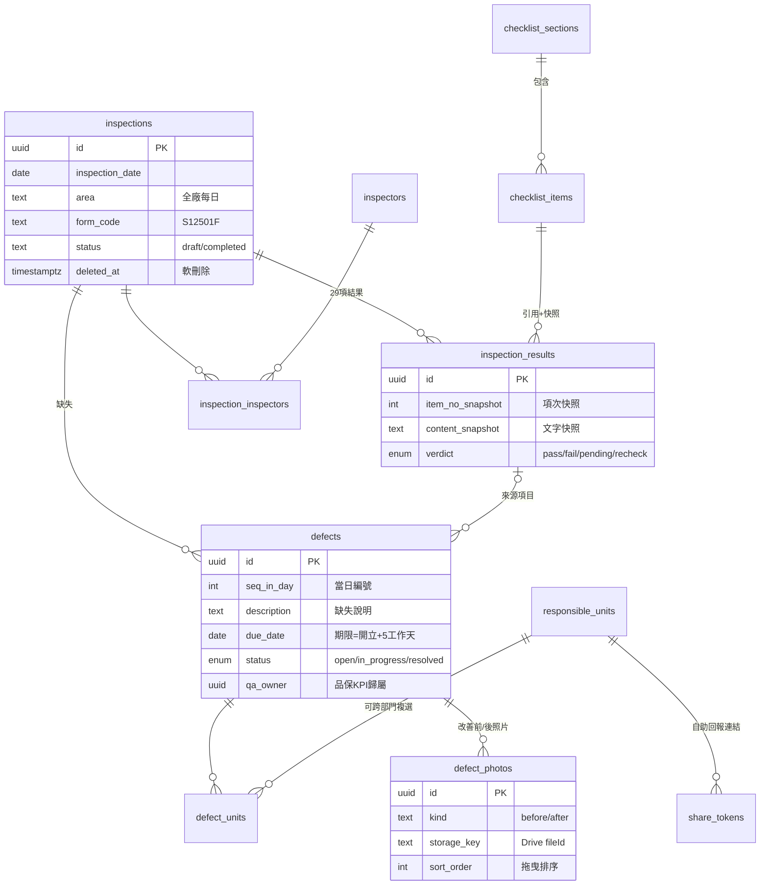

# 資料庫設計

Migration：`supabase/migrations/0001_init.sql`
Seed：`supabase/seed/seed.sql`（由 `npm run seed:generate` 從 JSON 產生）

## ER Diagram

## 資料表一覽

| 表 | 用途 | 備註 |
|---|---|---|
| `checklist_sections` | 三大類（人員/清潔準清潔區/環境） | seed 維護 |
| `checklist_items` | 29 個巡檢項目（項次 2~30） | 第 30 項有暫時性設施欄 |
| `responsible_units` | 權責單位主檔 | 後台可增修停用 |
| `inspectors` | 檢查/記錄人員主檔 | 同上 |
| `holidays` | 國定假日 | 工作天計算 |
| `app_settings` | SLA 天數等設定 | key-value(jsonb) |
| `inspections` | 每日巡檢單 | 唯一鍵：日期+區域（未刪除） |
| `inspection_inspectors` | 巡檢↔人員 多對多 | 紙本可多人簽 |
| `inspection_results` | 每項判定 + 項目快照 | 唯一鍵：巡檢+項目 |
| `defects` | 缺失單 | 軟刪除；resolved 鎖定 |
| `defect_units` | 缺失↔單位 多對多 | 跨部門 |
| `defect_photos` | 照片（before/after） | key 指向 Drive |
| `share_tokens` | 自助回報連結 token | 限單位、可過期 |
| `audit_logs` | 稽核軌跡 | 誰何時改了什麼 |

## DB 內建規則

- `set_updated_at`：自動更新 `updated_at`。
- `guard_resolved_defect`：已改善缺失禁改禁刪（trigger 層防護，繞過 UI 也擋）。
- `add_working_days(start, n)`：工作天計算（跳週末+假日），算改善期限用。
- RLS：MVP 全表僅 `authenticated` 可存取；自助回報走 service role API 控管。

## 部署步驟（Supabase SQL Editor）

1. 開 Supabase 後台 → SQL Editor → New query
2. 貼上 `supabase/migrations/0001_init.sql` → Run
3. 貼上 `supabase/seed/seed.sql` → Run
4. Table Editor 應可看到 29 筆 `checklist_items`、10 筆 `responsible_units`、3 筆 `inspectors`
